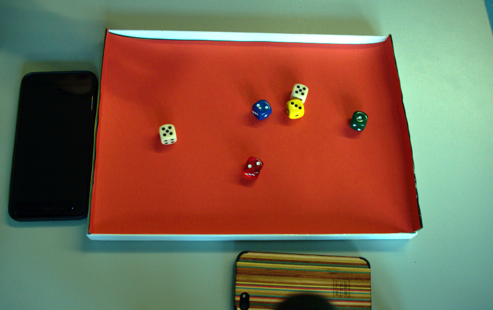

# D3-Deep-Dice-Detector

D3: Deep Dice Detector is an implementation of dice detection and top surface number recognition.

## Data Collection

Collect the dice dataset from different orientation and lighting conditions as depicted below.

 
 
