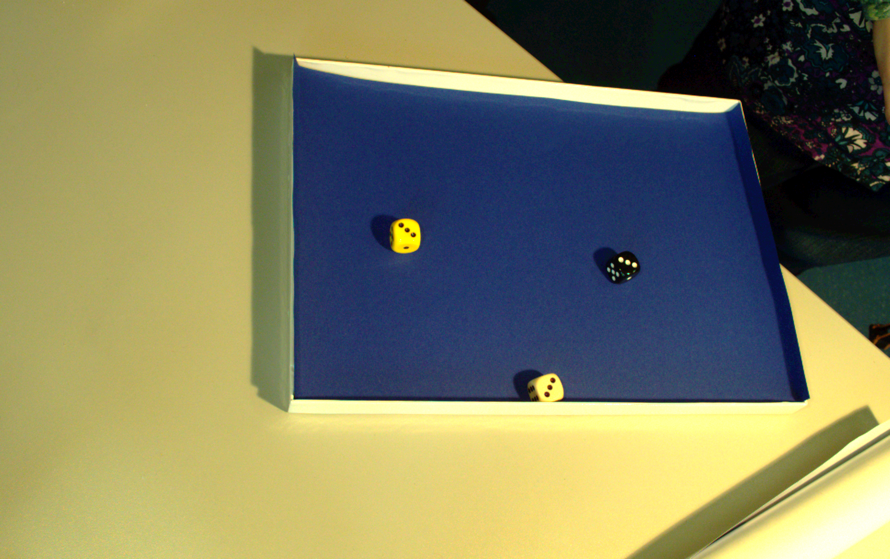

# D3-Deep-Dice-Detector

D3: Deep Dice Detector is an implementation of dice detection and top surface number recognition.

## Data Collection

Collect the dice dataset from different orientation and lighting conditions as depicted below.


 
 

## Data Annotation

Annotate the data using labelImg tool given [here](https://github.com/tzutalin/labelImg).

The annotations are done by me and given in the annoatations folder.

## Converting xml to csv format

The annotations are in xml format, convert it to csv format using the following command

(available under utils folder)

```
$ python xml_to_csv.py
```

## Shuffle the dataset into test and train

Please have a look at the following file

(available under utils folder)

```
$ jupyter notebook split_labels.ipynb 
```

## Convert the data to tfrecords

To create train.record

(available under utils folder)

```
$ python generate_tfrecord.py --csv_input=data/train_labels.csv  --output_path=train.record
```

To create test.record


```
python generate_tfrecord.py --csv_input=data/test_labels.csv  --output_path=test.record
```

NOTE: EDIT LINE 31 of the code according to the classes you have.

## Train using tensorflow object detection API

Please clone [this](https://github.com/tensorflow/models/tree/master/research/object_detection) repo. This is official tensorflow object detection API.

Tensorflow Object Detection API depends on the following libraries:

*   Protobuf 3.0.0
*   Python-tk
*   Pillow 1.0
*   lxml
*   tf Slim (which is included in the "tensorflow/models/research/" checkout)
*   Jupyter notebook
*   Matplotlib
*   Tensorflow (>=1.12.0)
*   Cython
*   contextlib2
*   cocoapi

Use this [installation](https://github.com/tensorflow/models/blob/master/research/object_detection/g3doc/installation.md) guide.

Select a model. In this case we selected mobiletNet-SSD. We have classes "dice", "sugarcube", "fo" and "bottlecap".  Our pbtxt looks like the following,

```
item {
  id: 1
  name: 'face'
}

item {
  id: 2
  name: 'bottlecap'
}

item {
  id: 3
  name: 'sugarcube'
}

item {
  id: 4
  name: 'fo'
}
```

The prepare the .config file. All of them is available in training folder.

Then you can run it [locally](https://github.com/tensorflow/models/blob/master/research/object_detection/g3doc/running_locally.md) or on [cloud](https://github.com/tensorflow/models/blob/master/research/object_detection/g3doc/running_on_cloud.md).

## Training

Training can be achieved by the following command

```
# From the tensorflow/models/research/ directory
PIPELINE_CONFIG_PATH={path to pipeline config file}
MODEL_DIR={path to model directory}
NUM_TRAIN_STEPS=50000
SAMPLE_1_OF_N_EVAL_EXAMPLES=1
python object_detection/model_main.py \
    --pipeline_config_path=${PIPELINE_CONFIG_PATH} \
    --model_dir=${MODEL_DIR} \
    --num_train_steps=${NUM_TRAIN_STEPS} \
    --sample_1_of_n_eval_examples=$SAMPLE_1_OF_N_EVAL_EXAMPLES \
    --alsologtostderr
```
